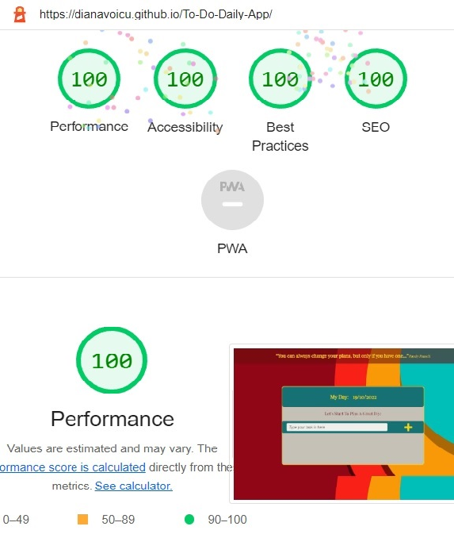

# To-Do Daily List App
## An Interactive Front-End Site Project.

*To-Do Daily List* is a front-end short application designed to help users organize their daily tasks. Users will be able to interact with the website by typing their plans and after manipulating the list by checking or deleting the task. 

The main goal was to create an interactive front-end project using JavaScript for educational purposes. HTML provides the structure of the page and CSS the styling.

***
## UX
***
### Website business goals

* The quick and simple access to the functionality of this application encourages a daily usage. This was acomplished by avoiding any extra steps in finding the app so automatically the experience of using the website would be easy and enjoyable for any user. 
* Targeting at individual level the app would be extremely accessible for all users, regardeless of their skills. After all the main aim of a website is popularity.
* In this case we want to achieve to become popular by the daily usage and targeting all types of users, in spite of their capability of using an application. 

### User goals

* User can easily access daily the web application from any type of device.
* User can easily type and list their tasks for the day.
* User is helped to organize their day in tasks to become more efficient. 
* User is reinforced to focus on their daily tasks and not on upcoming events. 
* User can review their tasks, check them complete, erase them or simply add new ones to their list.

***
## Structure of the website
***
* The page starts with a motivational quote meant to inspire the user.

* The vibrant colourful background image has two purposes:
   * To enable contrast to obtain an increased readability and legibility;
   * To improve the user experience and create an emotionally connection with him.

* The central part of the page contains the application itself.

### Surface
***

### Colours
***

* Main colours:

  * background-color (for quote): hsl(0deg 80% 23% / 57%)
  * background-color (for to-do app): #167175
  * font-color: #ffd600fc
  * font-color (text box): #7f1313

* Fonts:

  * font-family: Playfair Display, Open Sans, sans-serif

* Image:

  * The background image was download from [Pexels](https://www.pexels.com/)

***
## Features
***

 * The main feature of the website is the to-do list application, designed to be very responsive on every device:

   * The title of the application 'My Day' encourages the user to add a list for the current day. The current date is generated next to the title using  Date () constructor in JavaScript.

   * The text input box has an autofocus attribute to direct the user straight into the input field, and a hover efect styled with CSS.

   * On the right side of our text box is a plus icon button which will generate a list with the tasks typed by the user. The functionality of the plus button to create the list was accomplished in JavaScript by:

     *  Having a function and two events: onclick and keydown. By doing this we give to our user the option to add his task, either by click either by pressing the enter key. 
     
     * The code in the function will generate:  

       * An alert if the user doesn't type anything in the box.

       * Or will generate the user's task in a styled list below and remove it from the text box.

     * Each task added has as well two buttons offering the option for the task to be either checked, crossing a line over it or to be deleted.

***
## Testing 
***

 * I confirmed that this project is responsive, looks good and function on all standard screen sizes using the Chrome Developer Tool.
 * I confirmed that all the navigation links are working.
 * I confirmed that all text is readable and easy to understand.

 ## Validator Testing 
 ***
 
 * ### HTML 

    * The page have no errors when passing through the official W3C Validator.

* ### CSS 

    * The CSS stylesheet no errors when passing through the official (Jigsaw) Validator.

* ### Accesibility 

    * I confirmed the accesibility and the others scores for this website using the lighthouse, desktop and mobile version.

***
## Bugs
***

### Solved Bugs
***

* When validating my HTML I received an error for using an alt atribute for the font icons.
  * Removing the atribute fixed the issue.

* For JavaScript my buttons for checking and deleting the added tasks weren't working.

  * I thought it has to be related to the fact that my buttons were created in JavaScript using template literate and they don't exist in the actual HTML file.

  * Reading about the dinamically JavaScript helped to realize I was placing my function for those buttons wrong.

### Unsolved Bugs
***

* No unsolved bugs

***
## Deployment 
***

  * The site was deployed to GitHub Pages. The steps are:

    * In the GitHub repository, navigate to Settings tab. 
    * On the left side click Pages and after select from source section drop-down menu, Main Branch.
    * After a refresh the page provided the link to the completed website.

    The link can be accessed here [To-Do-Daily-App](https://dianavoicu.github.io/To-Do-Daily-App/)

***
## Credits
***

### Contents

* The code for Fontawesome used for social media icons was taken from [Code Institute-Love Maths Essentials project](https://learn.codeinstitute.net/courses/course-v1:CodeInstitute+LM101+2021_T1/courseware/2d651bf3f23e48aeb9b9218871912b2e/a8ec361b95e94c25bf8a821654bd57bc/) 
  * The code for fonts were provided by [Google Fonts](https://fonts.google.com/)

### Media 

* The background image was download from [Pexels](https://www.pexels.com/)
* The image was optimized by by [TinyPNG](https://tinypng.com/)

### Credits 

* To complete this project I used [Code Institute Student Template](https://github.com/Code-Institute-Org/gitpod-full-template)

* For ideas and  particular debugging problems I used: 

  * [Stack Community](https://stackoverflow.com/)
  * [Geeks for Geeks](https://geeksforgeeks.org/)
       

   
   *  
   

